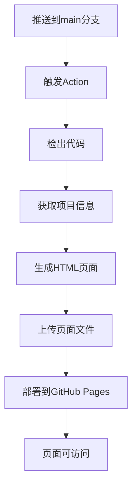

# 🌐 GitHub Pages 部署指南

## 🎯 功能说明

这个GitHub Action会自动为你的RPA项目生成一个漂亮的GitHub Pages页面，包含：

- 🤖 **项目介绍** - 自动从package.json读取项目信息
- 📊 **项目统计** - 提交次数、贡献者数量等
- ✨ **功能特性** - 展示RPA应用的核心功能
- 🛠️ **技术栈** - 显示使用的技术和工具
- 📱 **下载链接** - 链接到GitHub Releases
- 📋 **项目信息** - 最新提交、构建时间等

## 🚀 如何启用

### 1. 启用GitHub Pages
1. 打开你的GitHub仓库
2. 点击 **Settings** 标签页
3. 在左侧菜单找到 **Pages**
4. 在 **Source** 下选择 **GitHub Actions**

### 2. 触发部署
Action会在以下情况自动运行：
- 推送代码到 `main` 分支
- 手动触发（在Actions页面点击"Run workflow"）

### 3. 查看页面
部署完成后，你的页面地址将是：
```
https://你的用户名.github.io/你的仓库名/
```

## 📝 页面内容自定义

### 自动读取的信息
Action会自动从以下文件读取信息：
- `auto-rpa-app/package.json` - 应用名称、版本、描述
- Git历史 - 提交次数、贡献者、最新提交

### 手动自定义
如果需要自定义页面内容，可以修改 `.github/workflows/deploy-github-pages.yml` 文件中的HTML模板。

## 🎨 页面特性

### 响应式设计
- 📱 移动端友好
- 💻 桌面端优化
- 🎨 现代化UI设计

### 动态内容
- 📊 实时项目统计
- 🔗 自动链接到Releases
- ⏰ 自动更新时间戳

### 性能优化
- ⚡ 纯静态页面，加载快速
- 🎯 SEO友好
- 📱 移动端优化

## 🔧 故障排除

### 常见问题

1. **页面没有更新**
   - 检查Action是否成功运行
   - 确认GitHub Pages设置正确
   - 可能需要等待几分钟生效

2. **权限错误**
   - 确保仓库设置中启用了Actions
   - 检查Pages权限设置

3. **页面显示异常**
   - 检查HTML模板语法
   - 查看Action执行日志

### 调试方法
1. 查看Actions页面的执行日志
2. 检查生成的HTML文件
3. 验证GitHub Pages设置

## 📊 Action执行流程



## 🎉 完成！

现在你的RPA项目有了一个专业的展示页面！

- 🔗 **访问页面**: https://你的用户名.github.io/你的仓库名/
- 📊 **查看部署状态**: GitHub仓库的Actions页面
- 🔧 **自定义页面**: 修改workflow文件中的HTML模板

每次推送代码到main分支时，页面都会自动更新，展示最新的项目信息！ 