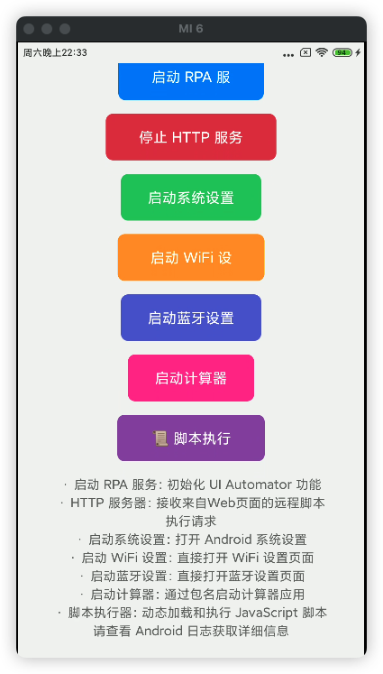

# 🤖 Auto RPA App - React Native 移动端自动化应用

<div align="center">


**一个功能强大的React Native RPA（机器人流程自动化）应用，专为Android设备自动化操作而设计**

[功能特性](#-功能特性) • [快速开始](#-快速开始) • [项目结构](#-项目结构) • [开发文档](#-开发文档) • [技术栈](#️-技术栈)

</div>

---

## ✨ 功能特性

### 🎯 核心功能
- **🤖 UI自动化操作** - 支持点击、滑动、输入等Android UI交互
- **📝 JavaScript脚本执行** - 动态执行自动化脚本，支持复杂逻辑
- **🌐 HTTP API服务** - 内置HTTP服务器，支持远程控制和脚本推送
- **🔗 Web远程调试** - 现代化Web界面，实时监控和调试
- **📱 系统集成** - 快捷访问系统设置、应用管理等功能

### 🛡️ 企业级特性
- **📄 完整日志系统** - 详细的操作日志和错误追踪
- **🔒 权限管理** - 安全的权限控制和访问管理
- **📦 脚本管理** - 支持脚本上传、下载、版本控制
- **⚡ 高性能执行** - 优化的执行引擎，支持并发操作
- **🔧 灵活配置** - 丰富的配置选项和自定义设置

---

## 🚀 快速开始

### 📋 环境要求

- **Node.js** >= 18.0.0
- **React Native CLI** >= 19.0.0
- **Android SDK** >= API 28
- **JDK** >= 11

### ⚡ 一键启动

```bash
# 1. 克隆项目
git clone https://github.com/your-username/rn-rpa-app.git
cd rn-rpa-app

# 2. 安装依赖
cd auto-rpa-app && npm install

# 3. 启动开发环境
npm start                    # 启动Metro服务器
npm run android             # 启动Android应用
npm run web-debug           # 启动Web调试界面
```

### 📱 设备配置

```bash
# 连接Android设备并启用USB调试
adb devices

# 安装应用到设备
cd android && ./gradlew assembleDebug
adb install app/build/outputs/apk/debug/app-debug.apk
```

---

## 📁 项目结构

```
rn-rpa-app/
├── 📱 auto-rpa-app/                 # 主应用目录
│   ├── 🔧 android/                  # Android原生代码
│   │   └── app/src/main/java/com/rpaapp/
│   │       ├── MainActivity.kt      # 主Activity
│   │       ├── RPAServiceModule.kt  # RPA服务模块
│   │       └── UIAutomatorHelper.kt # UI自动化助手
│   ├── 🌐 src/                      # React Native源码
│   │   ├── components/              # 组件库
│   │   ├── services/                # 服务层
│   │   ├── utils/                   # 工具函数
│   │   └── web-debug/               # Web调试界面
│   ├── 📄 doc/                      # 项目文档
│   ├── 🧪 test-scripts/             # 测试脚本
│   ├── 📝 example-scripts/          # 示例脚本
│   └── 📦 package.json              # 项目配置
├── 📚 DEVELOPMENT_COMMANDS.md       # 开发命令大全
├── ⚡ QUICK_COMMANDS.md             # 快速命令参考
└── 🖼️ assets/                       # 静态资源
```

---

## 🎥 功能演示

### 📱 应用界面

<div align="center">

| 主界面 | Web调试界面 |
|:---:|:---:|
|  |  |

</div>

### 🎬 演示视频

https://github.com/user-attachments/assets/0331affe-a6d9-4609-aca6-13dcee63d495

---

## 📚 开发文档

### 📖 核心文档
- **[📋 开发常用命令](./DEVELOPMENT_COMMANDS.md)** - 完整的开发命令集合和最佳实践
- **[⚡ 快速命令参考](./QUICK_COMMANDS.md)** - 最常用命令的快速查阅手册
- **[🔧 Web调试指南](./auto-rpa-app/README_WEB_DEBUG.md)** - Web远程调试详细说明
- **[🛠️ 项目架构](./auto-rpa-app/README.md)** - 项目架构和核心功能说明

### 📋 专业文档
- **[🚀 快速开始指南](./auto-rpa-app/QUICK_START.md)** - 新手入门完整教程
- **[🐛 调试指南](./auto-rpa-app/DEBUGGING_GUIDE.md)** - 问题排查和调试技巧
- **[📦 ADB推送指南](./auto-rpa-app/ADB_PUSH_GUIDE.md)** - 脚本部署和管理
- **[⚠️ 错误处理](./auto-rpa-app/SCRIPT_ERROR_HANDLING.md)** - 脚本错误处理最佳实践

---

## 🛠️ 技术栈

### 📱 前端技术
- **React Native 0.80.0** - 跨平台移动应用框架
- **TypeScript 5.0.4** - 类型安全的JavaScript超集
- **React 19.1.0** - 现代化UI库
- **Metro** - React Native打包工具

### 🔧 后端服务
- **Node.js** - Web调试服务器运行时
- **Express.js** - Web服务框架
- **HTTP Bridge** - React Native HTTP服务桥接

### 📱 Android原生
- **Kotlin** - Android原生开发语言
- **UI Automator 2.2.0** - Android UI自动化框架
- **Gradle 8.14.1** - Android构建工具

### 🛠️ 开发工具
- **ESLint** - 代码质量检查
- **Prettier** - 代码格式化
- **Jest** - 单元测试框架
- **Flipper** - 移动应用调试平台

---

## 🚀 使用场景

### 💼 企业应用
- **📊 数据采集自动化** - 自动收集应用数据和用户行为
- **🔄 重复任务自动化** - 批量处理重复性操作
- **🧪 应用测试自动化** - UI自动化测试和回归测试
- **📱 设备管理自动化** - 批量设备配置和管理

### 🎯 个人使用
- **⏰ 定时任务执行** - 定时执行特定操作
- **🎮 游戏辅助工具** - 游戏自动化脚本
- **📲 社交媒体管理** - 自动化社交媒体操作
- **🔧 系统维护工具** - 设备清理和优化

---

## 🤝 贡献指南

我们欢迎所有形式的贡献！请查看 [贡献指南](./CONTRIBUTING.md) 了解详细信息。

### 🐛 问题反馈
- 在 [Issues](https://github.com/your-username/rn-rpa-app/issues) 中报告bug
- 提供详细的复现步骤和环境信息
- 附上相关的日志和截图

### 💡 功能建议
- 在 [Discussions](https://github.com/your-username/rn-rpa-app/discussions) 中讨论新功能
- 提供详细的使用场景和需求描述

---

## 📄 许可证

本项目采用 [MIT 许可证](./LICENSE) - 查看 LICENSE 文件了解详细信息。

---

## 🙏 致谢

感谢所有为这个项目做出贡献的开发者和用户！

### 🌟 特别感谢
- React Native 社区提供的优秀框架
- Android UI Automator 团队的自动化工具
- 所有提供反馈和建议的用户

---

<div align="center">

**如果这个项目对你有帮助，请给我们一个 ⭐ Star！**

[⬆ 回到顶部](#-auto-rpa-app---react-native-移动端自动化应用)

</div>
