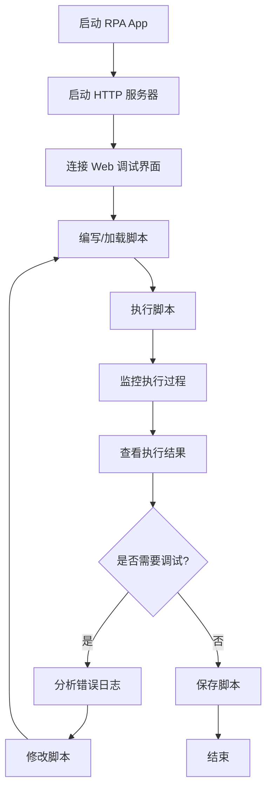
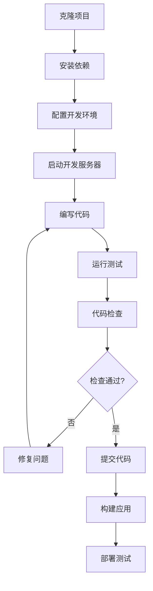

# 🎯 RPA App 项目概览

## 📋 项目简介

RPA App 是一个基于 React Native 的移动端机器人流程自动化（RPA）应用，专为
Android 平台设计。该应用允许用户通过动态脚本实现设备自动化操作，并提供了完整的
Web 调试界面和脚本管理系统。

## 🏗️ 项目架构

### 整体架构图

```
┌─────────────────────────────────────────────────────────────┐
│                    RPA App 架构                              │
├─────────────────────────────────────────────────────────────┤
│  📱 React Native 前端层                                      │
│  ├── App.tsx (主应用组件)                                    │
│  ├── Components (UI 组件)                                   │
│  └── Services (业务服务层)                                   │
├─────────────────────────────────────────────────────────────┤
│  🌐 HTTP 服务层                                              │
│  ├── HttpService (HTTP 服务器)                              │
│  ├── Web Debug Interface (Web 调试界面)                      │
│  └── API Endpoints (RESTful API)                           │
├─────────────────────────────────────────────────────────────┤
│  📜 脚本执行层                                                │
│  ├── ScriptService (脚本管理)                                │
│  ├── ScriptErrorAnalyzer (错误分析)                          │
│  └── Dynamic Script Execution (动态执行)                     │
├─────────────────────────────────────────────────────────────┤
│  🤖 原生 RPA 层                                              │
│  ├── RPAModule (原生 RPA 模块)                               │
│  ├── Android Accessibility Service                         │
│  └── Device Automation APIs                                │
├─────────────────────────────────────────────────────────────┤
│  💾 数据存储层                                                │
│  ├── FileService (文件操作)                                  │
│  ├── Script Storage (脚本存储)                               │
│  └── Log Management (日志管理)                               │
└─────────────────────────────────────────────────────────────┘
```

### 核心模块说明

#### 1. 📱 React Native 前端层

- **App.tsx**: 应用主入口，管理整体状态和导航
- **Components**: 可复用的 UI 组件
  - ScriptEditor: 脚本编辑器
  - ScriptList: 脚本列表
  - LogViewer: 日志查看器
  - StatusBar: 状态栏
- **Services**: 业务逻辑服务层

#### 2. 🌐 HTTP 服务层

- **HttpService**: 内置 HTTP 服务器，端口 8080
- **Web Debug Interface**: 浏览器端调试界面
- **RESTful API**: 提供脚本管理、执行、日志查看等 API

#### 3. 📜 脚本执行层

- **ScriptService**: 脚本生命周期管理
- **ScriptErrorAnalyzer**: 智能错误分析和建议
- **Dynamic Execution**: 支持 JavaScript 动态脚本执行

#### 4. 🤖 原生 RPA 层

- **RPAModule**: React Native 原生模块
- **Android Accessibility**: 利用 Android 无障碍服务
- **Device APIs**: 设备控制和自动化接口

#### 5. 💾 数据存储层

- **FileService**: 文件系统操作
- **Script Storage**: 脚本持久化存储
- **Log Management**: 日志记录和管理

## 🛠️ 技术栈

### 前端技术

| 技术         | 版本    | 用途                |
| ------------ | ------- | ------------------- |
| React Native | 0.80.0  | 跨平台移动应用框架  |
| TypeScript   | 5.0.4   | 静态类型检查        |
| React        | 18.2.0  | UI 组件库           |
| Metro        | 0.80.12 | JavaScript 打包工具 |

### 原生开发

| 技术        | 版本    | 用途             |
| ----------- | ------- | ---------------- |
| Android SDK | API 28+ | Android 原生开发 |
| Java        | 11+     | Android 原生代码 |
| Gradle      | 8.0+    | Android 构建工具 |

### 开发工具

| 工具     | 版本   | 用途                |
| -------- | ------ | ------------------- |
| Node.js  | 18+    | JavaScript 运行环境 |
| npm      | 9+     | 包管理器            |
| ESLint   | 8.19.0 | 代码规范检查        |
| Prettier | 2.8.8  | 代码格式化          |
| Jest     | 29.6.3 | 单元测试框架        |
| Husky    | 8.0.3  | Git hooks 管理      |

### 第三方库

| 库名                            | 版本   | 用途         |
| ------------------------------- | ------ | ------------ |
| react-native-fs                 | 2.20.0 | 文件系统操作 |
| react-native-http-bridge        | 0.6.0  | HTTP 服务器  |
| @react-native-community/netinfo | 11.3.1 | 网络状态检测 |

## 🚀 核心功能

### 1. 📜 动态脚本系统

- **脚本编辑**: 内置代码编辑器，支持语法高亮
- **动态执行**: 运行时加载和执行 JavaScript 脚本
- **错误处理**: 智能错误分析和修复建议
- **脚本管理**: 保存、加载、删除脚本文件

### 2. 🌐 Web 调试界面

- **远程调试**: 通过浏览器访问 `http://设备IP:8080`
- **脚本管理**: Web 端脚本编辑和执行
- **实时日志**: 实时查看应用和脚本执行日志
- **健康检查**: 服务器状态监控和诊断

### 3. 🤖 RPA 自动化

- **UI 自动化**: 模拟点击、滑动、输入等操作
- **设备控制**: 控制设备硬件功能
- **流程自动化**: 执行复杂的自动化流程
- **条件判断**: 支持条件逻辑和循环控制

### 4. 📊 监控和日志

- **实时监控**: 应用状态和性能监控
- **详细日志**: 分级日志记录系统
- **错误追踪**: 错误堆栈跟踪和分析
- **性能统计**: 脚本执行时间和成功率统计

## 🔄 工作流程

### 典型使用流程



### 开发工作流程



## 📈 项目特色

### 🎯 技术亮点

1. **跨平台架构**: React Native + 原生模块混合开发
2. **动态脚本**: 运行时 JavaScript 脚本执行
3. **Web 调试**: 内置 HTTP 服务器和 Web 界面
4. **智能错误分析**: 自动错误检测和修复建议
5. **完整工具链**: ESLint + Prettier + Husky + Jest

### 🛡️ 质量保证

1. **代码规范**: 严格的 ESLint 和 Prettier 配置
2. **类型安全**: 全面的 TypeScript 类型定义
3. **自动化测试**: Jest 单元测试和覆盖率检查
4. **Git 规范**: Conventional Commits 和自动化检查
5. **CI/CD**: GitHub Actions 自动化构建和部署

### 🔧 开发体验

1. **热重载**: React Native Fast Refresh
2. **实时调试**: Chrome DevTools 支持
3. **代码提示**: 完整的 TypeScript 智能提示
4. **自动修复**: 保存时自动格式化和修复
5. **详细文档**: 完整的开发和使用文档

## 🎯 应用场景

### 典型使用场景

1. **移动应用测试**: 自动化 UI 测试和回归测试
2. **重复任务自动化**: 批量操作和数据处理
3. **设备管理**: 批量设备配置和管理
4. **数据采集**: 自动化数据抓取和处理
5. **流程自动化**: 复杂业务流程的自动化执行

### 目标用户

- **测试工程师**: 移动应用自动化测试
- **运维人员**: 设备批量管理和维护
- **开发人员**: 开发调试和性能测试
- **业务人员**: 重复性任务自动化

## 🚀 未来规划

### 短期目标（1-3 个月）

- [ ] iOS 平台支持
- [ ] 更多 RPA 操作 API
- [ ] 脚本模板和示例库
- [ ] 性能优化和稳定性提升

### 中期目标（3-6 个月）

- [ ] 可视化脚本编辑器
- [ ] 云端脚本同步
- [ ] 多设备协同控制
- [ ] 高级调试工具

### 长期目标（6-12 个月）

- [ ] AI 辅助脚本生成
- [ ] 企业级管理平台
- [ ] 插件生态系统
- [ ] 商业化产品

---

**文档版本**: v1.0  
**最后更新**: 2024 年 12 月  
**维护者**: RPA App 开发团队
